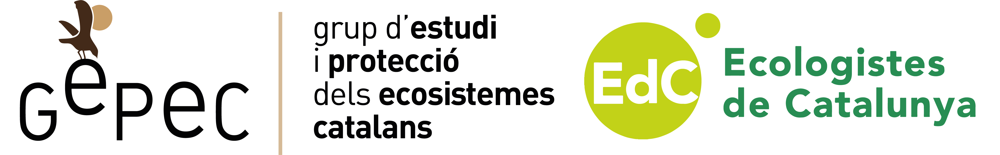

<picture>
  <source media="(prefers-color-scheme: light)" srcset="/docs/logo_tiny_dark.svg">
  
</picture>

Transsectes APP: mobile application for carrying out transects along the beaches to locate sea turtles or their nests

<h3>

[Homepage](https://github.com/0xArnau/transsectes_app/tree/trunk) | [Play store (comming soon)](https://play.google.com/store/apps/developer?id=GEPEC-EdC) | [App store (comming soon)](https://apps.apple.com/us/developer/elisabeth-bofill-ventosa/id1697539680)

</h3>

---
