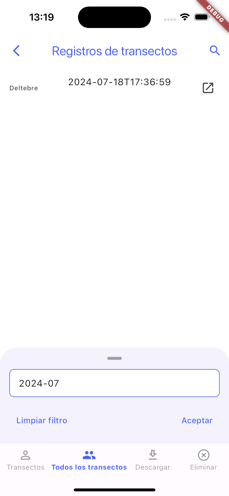

# Transsectes APP: mobile application for carrying out transects along the beaches to locate sea turtles or their nests

<h3>

[Homepage](https://github.com/0xArnau/transsectes_app/tree/trunk) | [Play store (comming soon)](https://play.google.com/store/apps/developer?id=GEPEC-EdC) | [App store (comming soon)](https://apps.apple.com/us/developer/elisabeth-bofill-ventosa/id1697539680)

</h3>

<picture>
  <source media="(prefers-color-scheme: dark)" srcset="assets/imgs/logo/GEPEC_EdC_OFICIAL_blanc.png">
  
</picture>

## Table of Contents

- [Transsectes APP: mobile application for carrying out transects along the beaches to locate sea turtles or their nests](#transsectes-app-mobile-application-for-carrying-out-transects-along-the-beaches-to-locate-sea-turtles-or-their-nests)
  - [Table of Contents](#table-of-contents)
    - [Screenshots](#screenshots)
    - [Installation](#installation)
    - [Usage](#usage)
    - [Features](#features)
      - [Users](#users)
      - [Technicians](#technicians)

---

### Screenshots

| Auth | Forgot password | Forgot password |
|------|-----------------|-----------------|
|  |  |  |

| Sign up, part 1   | Sign up, part 2 | Sign up, part 3 |
|------|-----------------|-----------------|
|  |  |  |

| Home   | Menu | Change language | Contact |
|------|-----------------|-----------------|-----------------|
|  |  |   |  |

| How to make a transect | Start/Stop a transect | Start/Stop a transect, send | 
|------|-----------------|-----------------|
|  |  |  |

| Transects (User)   | Transects (Technician) | Download transects | Remove transects (Technician) |
|------|-----------------|-----------------|-----------------|
|  |  |  |  |

### Installation

coming soon...

### Usage

coming soon...

### Features

#### Users

- Create transects (the app listens to the GPS in the background and records the position; once the transect is finished, it asks - a few questions)
- Discard transects
- View transects on the map

#### Technicians

- View all users' transects
- Download all users' transects
- View transects on the map
- Delete all users' transects
